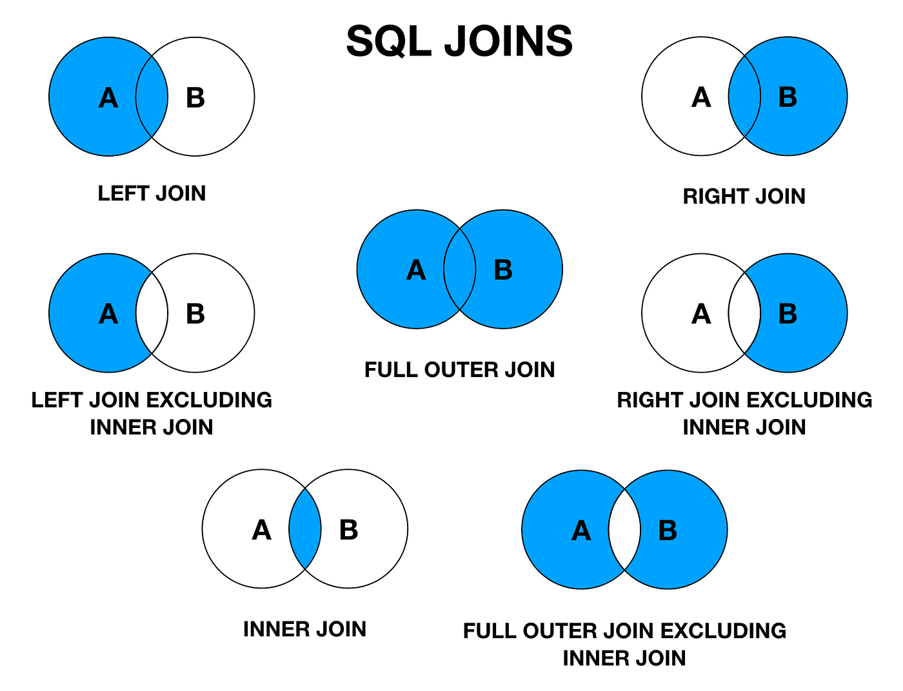

# SQL
This repo contains all sql quries

#  SQL Joins




## INNER JOIN --> intersection of two

```SQL
SELECT *
FROM student
INNER JOIN course
ON student.id = course.c_id;


# alias
SELECT *
FROM student as s
INNER JOIN course as c
ON s.id = c.c_id;

```

## 

```SQL
# Left join --> A + intersection of A with b

SELECT * 
From student 
LEFT JOIN course
ON student.id = course.c_id;

SELECT * 
From course as c
LEFT JOIN student as s
ON c.c_id= s.id;
```

## 

```SQL
# right join all table data from right and interstion from left

SELECT * 
FROM student AS s
RIGHT JOIN course as c
ON s.id = c.c_id;

```

## full join using left join and right join with union

```SQL
SELECT * 
From student as s
LEFT JOIN course as c
ON  s.id= c.c_id
UNION
SELECT * 
FROM student AS s
RIGHT JOIN course as c
ON s.id = c.c_id;
```

## Left exclusive join 

```SQL
SELECT *
FROM student as s
LEFT JOIN course as c
ON s.id = c_id
WHERE c.c_id IS NULL;
```

##  Right exclusive join 

```SQL
SELECT *
FROM student as s
RIGHT JOIN course as c
ON s.id = c_id
WHERE s.id IS NULL;

```

## SLEF JOIN

```SQL
SELECT *
FROM employee as a
JOIN employee as b
ON a.id = b.manager_id;

SELECT a.name , b.name
FROM employee as a
JOIN employee as b
ON a.id = b.manager_id;

```

## 

```SQL


```

## 

```SQL


```

## 

```SQL


```

## 

```SQL


```

## 

```SQL


```

## 

```SQL


```

## 

```SQL


```

## 

```SQL


```

## 

```SQL


```

## 

```SQL


```

## 

```SQL


```

## 

```SQL


```

## 

```SQL


```

## 

```SQL


```

## 

```SQL


```

## 

```SQL


```

## 

```SQL


```

## 

```SQL


```

## 

```SQL


```

## 

```SQL


```

## 

```SQL


```

## 

```SQL


```

## 

```SQL


```

## 

```SQL


```


